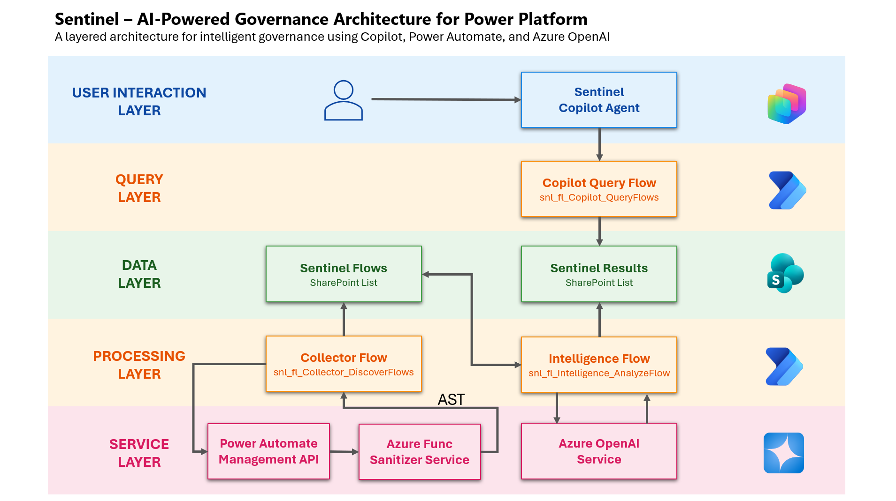

# 🚀 Sentinel Copilot Agent
### AI-Powered Governance for Power Platform

Sentinel Copilot Agent is an intelligent, enterprise-grade governance system that transforms how organizations monitor, analyze, and interact with Power Platform assets.

It combines **Copilot Studio**, **Power Automate**, **Azure OpenAI**, and **Azure Functions** to deliver **autonomous, AI-driven governance with conversational insights**.

---

## 🎯 Problem Statement

As Power Platform adoption scales, governance becomes a critical challenge:

- ❌ Limited visibility into flows and their behavior  
- ❌ Security risks (hardcoded secrets, external calls)  
- ❌ Missing retry, error handling, and resilience patterns  
- ❌ Manual, time-consuming audits  
- ❌ No simple way to query governance insights  

👉 Result: **Operational risk, compliance gaps, and production failures**

---

## 💡 Solution Overview

Sentinel introduces a **hybrid AI + rule-based governance model**:

### ✅ What it does:

- Automatically discovers Power Automate flows  
- Analyzes flow definitions using **Azure OpenAI (semantic AI)**  
- Performs structural validation via **Azure Function (AST-style analysis)**  
- Stores insights in structured format (SharePoint)  
- Enables natural language interaction via **Copilot Studio**  

---

## 🧠 Key Innovation

### 🔥 Hybrid Intelligence Model

| Layer | Purpose |
|------|--------|
| Azure OpenAI | Semantic risk detection |
| Azure Function (AST) | Structural validation |
| Power Automate | Orchestration |
| Copilot Studio | Conversational interface |

👉 This combination ensures **both depth and accuracy**, unlike traditional governance tools.

---

## 🤖 Copilot Experience

Users can interact naturally:

> **"Show high risk flows"**  
> **"Explain snl_fl_Test_BadFlow"**  
> **"Create bug for this flow"**

✅ Instant insights  
✅ Human-readable explanations  
✅ Actionable governance  

---

## 🧩 Key Features

### ✅ Autonomous Flow Discovery
- Scheduled collector flow
- Extracts metadata + definition JSON

### ✅ AI-Powered Risk Analysis
- Detects:
  - Hardcoded secrets  
  - Missing retry policies  
  - External HTTP risks  
  - Data exposure issues  

### ✅ AST-Based Structural Analysis
- Azure Function (`SentinelSanitizer`)
- Identifies:
  - Unsafe patterns
  - Missing resiliency configurations
  - Structural anti-patterns

### ✅ Unified Governance Data
Stored in SharePoint:
- Risk Score
- Risk Level
- Issue Summary
- Structured JSON insights

### ✅ Conversational Copilot Interface
- Query flows
- Explain issues
- Assist governance decisions

---

## 🏗️ Architecture Overview

Sentinel follows a **layered enterprise architecture** designed for scalable, AI-powered governance of Power Platform solutions.

---

### 🔹 1. User Interaction Layer
- **Sentinel Copilot Agent (Copilot Studio)**
- Provides a conversational interface for users to interact with governance insights
- Accepts natural language queries and initiates downstream processing

---

### 🔹 2. Query Layer
- **Copilot Query Flow (`snl_fl_Copilot_QueryFlows`)**
- Interprets user intent from Copilot
- Retrieves governance insights from the data layer
- Formats and returns responses back to the Copilot agent

---

### 🔹 3. Data Layer
- **Sentinel Flows (SharePoint List)**  
  Stores:
  - Flow metadata  
  - Flow Definition JSON  
  - Processing status  

- **Sentinel Results (SharePoint List)**  
  Stores:
  - Risk scores and levels  
  - Issue summaries  
  - Governance insights (AI + AST results)  

---

### 🔹 4. Processing Layer
- **Collector Flow (`snl_fl_Collector_DiscoverFlows`)**
  - Uses Power Automate Management API to discover flows
  - Extracts and stores metadata in Sentinel Flows  

- **Intelligence Flow (`snl_fl_Intelligence_AnalyzeFlow`)**
  - Orchestrates analysis pipeline
  - Sends flow definitions to:
    - Azure OpenAI (semantic analysis)
    - Azure Function (AST-based structural analysis)
  - Stores enriched results in Sentinel Results  

---

### 🔹 5. Service Layer
- **Power Automate Management API**
  - Enables automated discovery of flows  

- **Azure Function (SentinelSanitizer)**
  - Performs structural (AST-style) validation of flow definitions  
  - Detects unsafe patterns and configuration gaps  

- **Azure OpenAI Service**
  - Performs semantic analysis of flow logic  
  - Generates human-readable explanations and risk insights  

---

✅ This layered architecture enables a **hybrid governance model** combining:
- AI-driven semantic understanding  
- Rule-based structural validation  
- Automated data collection and orchestration  
- Conversational user experience via Copilot  

---

## 🔄 System Workflow

1. **Collector Flow**
   - Discovers flows via Power Automate API
   - Stores metadata

2. **Intelligence Flow**
   - Sends definition to:
     - Azure OpenAI (semantic analysis)
     - Azure Function (AST analysis)
   - Stores results

3. **Copilot Query Flow**
   - Retrieves insights
   - Formats responses

4. **Copilot Agent**
   - Handles user queries

---

## 📊 Data Model

### 🔹 Sentinel Flows
- Flow metadata  
- Definition JSON  
- Processing status  

### 🔹 Sentinel Results
- Risk score  
- Risk level  
- Governance issues  
- Insights  

👉 Setup guide:  
`./docs/sharepoint-setup.md`

---

## 🤖 AI Integration

Sentinel uses **Azure OpenAI** to:

- Interpret flow logic semantically  
- Detect complex governance risks  
- Generate human-readable explanations  

👉 Config details:  
`./docs/ai/openai-usage.md`

---

## 🔐 Security & Compliance (AST Protection Layer)

Sentinel is designed with enterprise-grade security and responsible AI principles.

### ✅ Sensitive Data Protection

- The Azure Function (`SentinelSanitizer`) acts as a **pre-processing layer**
- It performs AST-style analysis to:
  - Detect sensitive patterns (keys, URLs, secrets)
  - Sanitize or avoid sending sensitive data to AI models

### ✅ Controlled AI Exposure

- Only **necessary and sanitized inputs** are sent to Azure OpenAI  
- Prevents leakage of:
  - Credentials  
  - Internal endpoints  
  - Sensitive configurations  

### ✅ Compliance Alignment

This ensures alignment with:

- Enterprise security policies  
- Responsible AI usage  
- Data minimization principles  

👉 Sentinel implements a **“Analyze First, Send Later”** approach for safe AI integration.

---

## ⚙️ Azure Function (AST Analysis)

Located in: /azure-function

### Purpose:
- Structural validation of flow definitions  
- Deterministic rule enforcement  

Function: SentinelSanitizer

✅ Complements AI with rule-based enforcement  
✅ Adds enterprise extensibility  

---

## 🎥 Demo Video

👉 Watch the 5-minute demo:  
`./demo/demo-link.md`

---

## 🚀 Complete Setup Instructions

Follow these steps to deploy Sentinel end-to-end.

---

### 1️⃣ Import Solution

Import the managed solution: /solution/managed/Sentinel_Managed_v1.1.0.0.zip

---

### 2️⃣ Configure SharePoint

Create two lists:

- **Sentinel Flows**
- **Sentinel Results**

👉 Full schema:
`./docs/sharepoint-setup.md`

---

### 3️⃣ Configure Environment Variables

Sentinel relies on environment variables for secure configuration.

#### 🔐 Core Variables

- `env_TenantID`
- `env_EnvironmentID`
- `env_EnvironmentGUID`

#### 🔗 Power Automate API

- `env_PowerAutomateAPI`
- `env_PowerAutomateClientID`
- `env_PowerAutomateClientSecret`
- `env_MsftAuthorityLoginURL`
- `env_PowerAutomateAudienceServiceURL`

#### 🤖 Azure OpenAI

- `env_OpenAI_API_URL`
- `env_OpenAI_API_Key`

#### ⚙️ Azure Function (AST Analyzer)

- `env_SentinelSanitizer_FunctionUrl`
- `env_SentinelSanitizer_FunctionKey`

#### 📂 SharePoint

- `env_SharePointSiteUrl`
- `env_SentinelFlowsListName`
- `env_SentinelResultsListName`

✅ These variables enable secure and environment-independent deployment.

---

### 4️⃣ Deploy Azure Function

1. Deploy the function from:

/azure-function

2. Copy:
- Function URL
- Function Key

3. Update environment variables accordingly

---

### 5️⃣ Configure Power Automate Flows

Ensure flows are:

- Turned ON ✅
- Connected via connection references ✅
- Using environment variables ✅

Flows included:

- `snl_fl_Collector_DiscoverFlows`
- `snl_fl_Intelligence_AnalyzeFlow`
- `snl_fl_Copilot_QueryFlows`

---

### 6️⃣ Configure Copilot Agent

- Publish the Copilot (Copilot Studio)
- Ensure topics trigger flows correctly

---

### 7️⃣ Validate System

Test via Copilot:

- Show high risk flows  
- Explain a flow  
- Create bug for a flow  

✅ You should receive AI-powered governance insights

---

## 🎯 Target Users

- Power Platform Administrators  
- Governance Teams  
- Enterprise IT  

---

## ✅ Example Use Case

Instead of manually auditing flows:

**User:**  
> Show high risk flows  

✅ Sentinel returns prioritized results  

**User:**  
> Explain a flow  

✅ AI explains issues clearly  

---

## 🔮 Future Enhancements

Sentinel is designed to evolve into a **full Power Platform Governance Suite**.

### 🚀 Planned Enhancements

- ✅ Integration with Azure DevOps / Jira (automated bug creation)  
- ✅ Knowledge base with semantic search (vector embeddings)  
- ✅ Predictive risk scoring using AI  
- ✅ Multi-agent orchestration  

---

### 🌐 Power Platform Ecosystem Expansion

Sentinel will expand beyond Power Automate to:

- **Power Apps** → App governance & anti-pattern detection  
- **Power Pages** → Security and exposure analysis  
- **Power BI** → Data governance and report auditing  
- **Dataverse** → Data-level governance and anomaly detection  

---

### 🧠 Advanced Capabilities

- Cross-platform governance insights  
- Unified governance dashboard  
- Real-time compliance monitoring  

👉 Vision: A **centralized AI-powered governance platform for the entire Power Platform ecosystem**

---

## 🏆 Why Sentinel Stands Out

✅ Copilot-first governance experience  
✅ Hybrid AI + AST analysis  
✅ Fully automated governance pipeline  
✅ Extensible enterprise architecture  

---

## 🏁 Conclusion

Sentinel transforms governance from:

❌ Manual + Reactive  
➡️  
✅ Intelligent + Autonomous  

---

## 📦 Solution Package

Available in:

/solution/managed/

/solution/unmanaged/

---

## 🙌 Built With

- Microsoft Copilot Studio  
- Power Automate  
- SharePoint  
- Azure OpenAI  
- Azure Functions  

---
